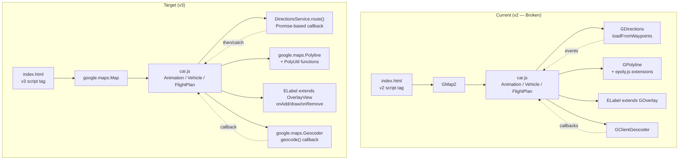
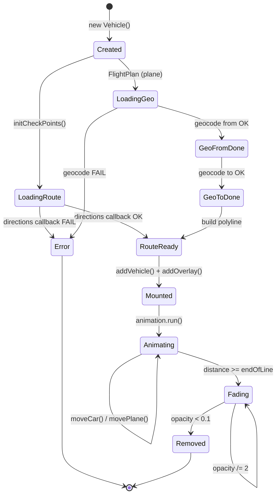
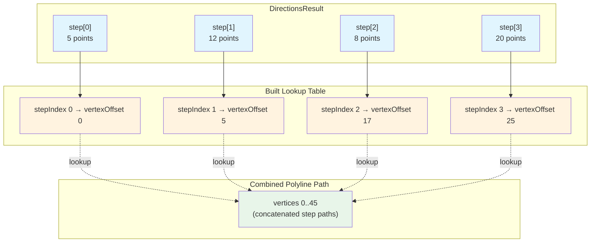
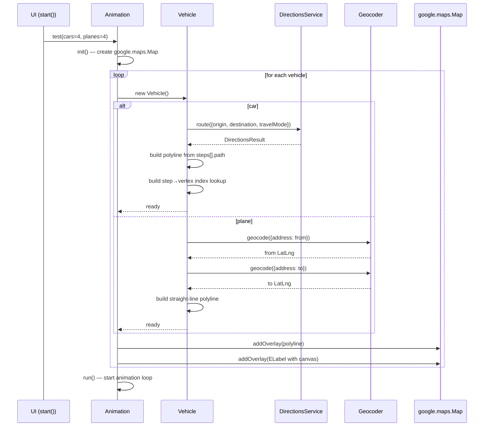
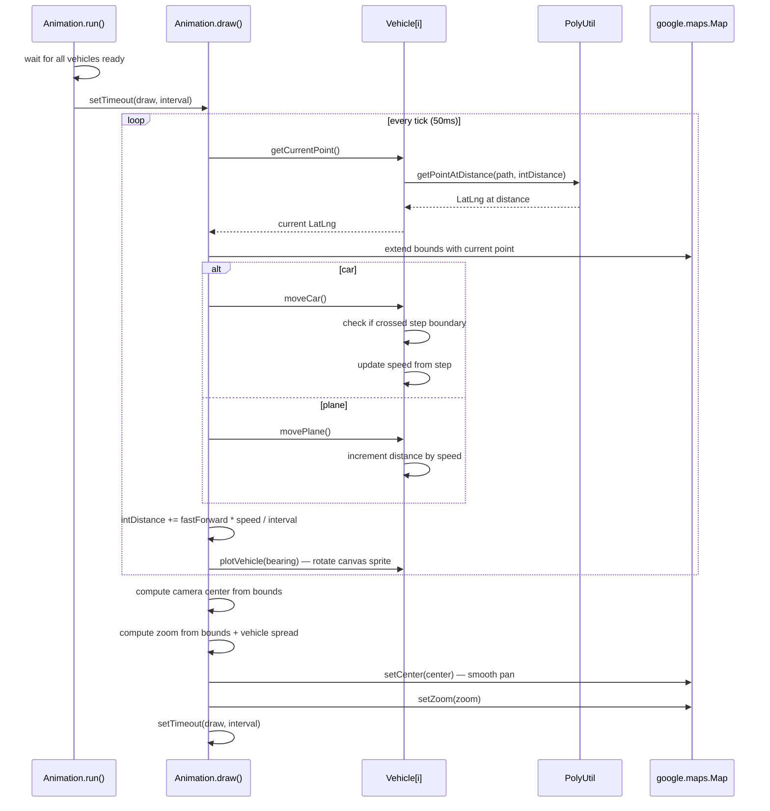
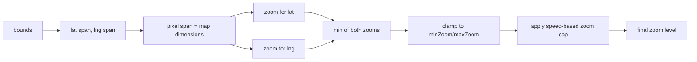
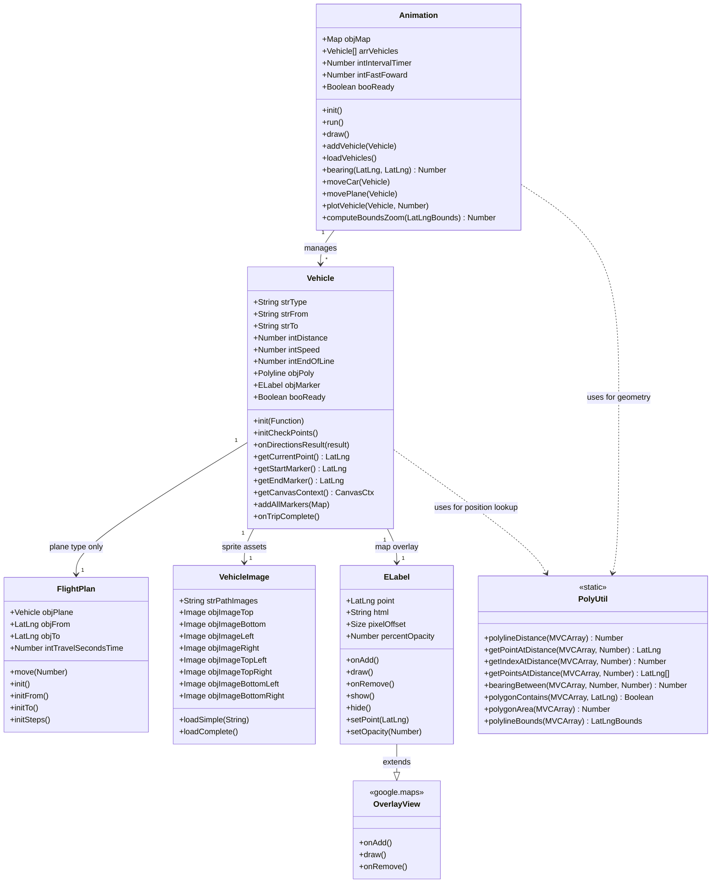

# Ticket 001: Migrate from Google Maps API v2 to v3

**Priority:** Critical
**Severity:** P0 — Blocking
**Estimated Effort:** 2–3 days

---

## Description

The project uses Google Maps JavaScript API v2 (`v=2` in the script URL), shut down by Google in 2010. The entire application is non-functional. Every Google Maps API call across all JS files must be migrated to v3 equivalents.

### Affected Files
- `index.html` — Script tag URL, API key
- `car.js` — All map initialization, routing, animation logic (~1500 lines)
- `epoly.js` — GPolygon/GPolyline extension methods
- `elabel.js` — GOverlay-based HTML label overlay

### Key API Mappings

| API v2 | API v3 |
|---|---|
| `GMap2` | `google.maps.Map` |
| `GLatLng` | `google.maps.LatLng` |
| `GPolyline` | `google.maps.Polyline` |
| `GPolygon` | `google.maps.Polygon` |
| `GDirections` | `google.maps.DirectionsService` + `DirectionsRenderer` |
| `GClientGeocoder` | `google.maps.Geocoder` |
| `GMarker` | `google.maps.Marker` |
| `GOverlay` | `google.maps.OverlayView` |
| `GEvent.bind` / `GEvent.addListener` | `google.maps.event.addListener` |
| `GBounds` | `google.maps.LatLngBounds` |

---

## Expected Outcome

- All four files (`index.html`, `car.js`, `epoly.js`, `elabel.js`) use Google Maps JS API v3
- Map renders and loads without errors
- Vehicle animation, routing, and camera-following work as before
- Zero console errors referencing v2 classes

---

## Concerns

1. `GDirections` in v2 returned step-by-step route data used extensively for animation interpolation. The v3 `DirectionsService` response shape is different — step parsing logic needs a full rewrite.
2. `ELabel` uses the v2 overlay system. Will need a v3 custom overlay replacement or a library like `MarkerWithLabel`.
3. `epoly.js` methods (`Distance()`, `Bearing()`, `GetPointAtDistance()`) are prototype extensions on v2 classes. These become standalone utility functions accepting v3 objects.

---

## Risks

| Risk | Likelihood | Impact | Mitigation |
|---|---|---|---|
| Directions API response format breaks route parsing | High | High | Audit all v2 response fields; test against v3 responses immediately |
| Overlay replacement breaks sprite positioning | Medium | Medium | Use proven v3 overlay library; test extensively |
| Scope creep into full rewrite | High | High | Strict 1:1 behavior migration; defer refactoring to separate tickets |
| API key billing/quota changes | Medium | Medium | Ensure key has Maps JS + Directions + Geocoding APIs enabled |

---

## Dependencies

- **Blocks:** Tickets 002–009
- **Blocked by:** None

---

## Related Tickets

- Ticket 003: Externalize API key
- Ticket 005: Modernize to ES6+ modules
- Ticket 006: Fix Canvas overlay for modern browsers

---

## Detailed Implementation Plan

### Approach: Layered migration with working state at each layer

Each layer is a separate commit. No layer breaks the app more than the previous one.

### Architecture — Current vs Target



### Vehicle Lifecycle — State Machine



---

### Layer 1: `index.html` — API script and map initialization

**What changes:**
- Replace `<script src="http://maps.google.com/maps?file=api&amp;v=2&amp;...">` with `<script src="https://maps.googleapis.com/maps/api/js?v=3&libraries=geometry&key=YOUR_KEY">`
- Remove `onunload="GUnload()"` from `<body>` (not needed in v3)
- Add map initialization options object (center, zoom, mapTypeId)

**Code mapping:**
```
// v2 (car.js:556-558)
this.objMap = new GMap2( document.getElementById( this.strIdMap ) );
this.objMap.addControl( new GMapTypeControl() );
this.objMap.setCenter( new GLatLng(0,0) , 2 );

// v3
this.objMap = new google.maps.Map( document.getElementById( this.strIdMap ), {
    center: { lat: 0, lng: 0 },
    zoom: 2,
    mapTypeId: google.maps.MapTypeId.ROADMAP
});
```

**Verification criteria:**
- Page loads with no console errors
- Map renders at the default center (0,0) zoom 2
- Pan and zoom work manually

---

### Layer 2: `epoly.js` → standalone geometry utilities

**What changes:**
- Convert all `GPolygon.prototype.*` and `GPolyline.prototype.*` methods to standalone functions
- Replace `GLatLng` with `google.maps.LatLng`
- Replace `point.distanceFrom(other)` with `google.maps.geometry.spherical.computeDistanceBetween(point, other)`
- Replace `getVertex(i)` / `getVertexCount()` with `path.getAt(i)` / `path.getLength()` where `path = polyline.getPath()`

**Methods to port:**
| v2 Method | v3 Signature |
|---|---|
| `poly.Distance()` | `polylineDistance(path)` |
| `poly.GetPointAtDistance(m)` | `getPointAtDistance(path, metres)` |
| `poly.GetIndexAtDistance(m)` | `getIndexAtDistance(path, metres)` |
| `poly.GetPointsAtDistance(m)` | `getPointsAtDistance(path, interval)` |
| `poly.Bearing(v1, v2)` | `bearingBetween(path, v1, v2)` |
| `poly.Contains(point)` | `polygonContains(path, point)` |
| `poly.Area()` | `polygonArea(path)` |
| `poly.Bounds()` | `polylineBounds(path)` |

**Design decision:** Wrap these in a `PolyUtil` namespace object rather than polluting globals. The utility functions accept `google.maps.MVCArray<LatLng>` (what `polyline.getPath()` returns).

**Verification criteria:**
- Create a test polyline with 3 known points
- `polylineDistance` returns correct total length
- `getPointAtDistance` returns correct interpolated point at halfway
- `bearingBetween` returns correct angle between first two vertices

---

### Layer 3: `elabel.js` → v3 `OverlayView`

**What changes:**
- Replace `GOverlay` inheritance with `google.maps.OverlayView`
- Replace `initialize(map)` with `onAdd()`, `draw()`, `onRemove()`
- Replace `map.getPane(G_MAP_FLOAT_SHADOW_PANE)` with `this.getPanes().overlayMouseTarget` (or similar pane)
- Replace `map.fromLatLngToDivPixel()` with `this.getProjection().fromLatLngToDivPixel()`
- Remove browser-specific opacity hacks (filter, KHTMLOpacity, MozOpacity) — modern CSS `opacity` works everywhere

**Architecture note:** If `OverlayView` proves too complex for this use case, the fallback is to use `google.maps.Marker` with a canvas-generated data URL as the icon. This is simpler but loses the live Canvas element (would need to regenerate data URL on each frame).

**Verification criteria:**
- A single ELabel with a `<canvas>` element appears at a known coordinate
- Canvas content renders correctly
- ELabel moves when its coordinate is updated via `setPoint()`
- ELabel is removed from DOM when `remove()` is called

---

### Layer 4: `Vehicle` — DirectionsService + Geocoder

**This is the hardest layer.** The entire routing and step-tracking logic changes.

**4a. Directions API call:**
```
// v2 (car.js:1164-1174)
this.objDirection = new GDirections();
this.objDirection.loadFromWaypoints([this.strFrom, this.strTo], {getPolyline:true, getSteps:true});
GEvent.addListener(this.objDirection, "load", this.onLoadCar.bind(this));
GEvent.addListener(this.objDirection, "error", this.onError.bind(this));

// v3
this.directionsService = new google.maps.DirectionsService();
this.directionsService.route({
    origin: this.strFrom,
    destination: this.strTo,
    travelMode: google.maps.TravelMode.DRIVING
}, (result, status) => {
    if (status === google.maps.DirectionsStatus.OK) {
        this.onDirectionsResult(result);
    } else {
        this.onError(status);
    }
});
```

**4b. Response structure mapping:**

| v2 Access Pattern | v3 Access Pattern |
|---|---|
| `objDirection.getPolyline()` | Extract from `result.routes[0].overview_path` (deprecated in newer v3) OR decode `result.routes[0].overview_polyline.points` |
| `objDirection.getRoute(0).getNumSteps()` | `result.routes[0].legs[0].steps.length` |
| `objDirection.getRoute(0).getStep(n)` | `result.routes[0].legs[0].steps[n]` |
| `step.getDistance().meters` | `step.distance.value` |
| `step.getDuration().seconds` | `step.duration.value` |
| `step.getDescriptionHtml()` | `step.instructions` |
| `step.getPolylineIndex()` | Must compute: cumulative vertex offset across steps |

**Critical issue — polyline index tracking:** In v2, each step had a `getPolylineIndex()` that told you which vertex in the overall polyline corresponded to that step. In v3, this doesn't exist directly. We need to build a lookup table that maps step index → vertex index by summing up the number of points in each step's polyline.

**Step-to-vertex index mapping strategy:**



**4c. Building the route polyline:**
The v3 `DirectionsResult` gives us `overview_path` (simplified) or individual step polylines (encoded). For animation accuracy, we need the full detailed path. Strategy: concatenate all `step.path` arrays from `routes[0].legs[0].steps[].path` into a single `MVCArray<LatLng>`.

**4d. Geocoding for planes:**
```
// v2 (car.js:1329-1332)
this.objGeoCoder.getLatLng(this.objPlane.strFrom, this.loadFrom.bind(this));

// v3
this.geocoder.geocode({ address: this.objPlane.strFrom }, (results, status) => {
    if (status === google.maps.GeocoderStatus.OK) {
        this.loadFrom(results[0].geometry.location);
    }
});
```

**4e. Error handling:**
Replace v2 error constants (`G_GEO_TOO_MANY_QUERIES`, etc.) with v3 status codes (`google.maps.GeocoderStatus.OVER_QUERY_LIMIT`, etc.).

**4f. Vehicle initialization flow (v2 vs v3):**



**Verification criteria:**
- Create a Vehicle with two known addresses
- `DirectionsService` returns a valid route
- Polyline is built and displayed on map
- Step tracking works (can identify which step the vehicle is on)
- Speed is calculated correctly from step distance/duration

---

### Layer 5: `Animation` loop + vehicle management

**What changes:**
- Replace `google.maps.LatLngBounds` (already partially done — line 247 uses v3 syntax but line 333 uses `GPolyline`)
- Replace `this.objMap.getCenter().distanceFrom(...)` with `google.maps.geometry.spherical.computeDistanceBetween()`
- Replace `this.objMap.getBoundsZoomLevel(objBounds)` with a custom function (v3 removed this; use `map.fitBounds()` or compute zoom manually)
- Replace camera panning logic that creates temporary `GPolyline` for interpolation (line 333-337)
- Replace `setZoom()` with smoother transition
- Fix `loadVehicles` to use the new callback-based initialization (no more polling for `booReady`)

**5a. Animation loop flow:**



**5b. Camera zoom calculation (replacing `getBoundsZoomLevel`):**



**getBoundsZoomLevel replacement:**
v3 doesn't have `getBoundsZoomLevel()`. Two options:
1. Use `map.fitBounds(bounds)` — but this is instant, no smooth zoom
2. Implement manually: calculate the zoom level at which the bounds fit in the current viewport dimensions

We'll implement the manual calculation to preserve the smooth zoom behavior.

**Verification criteria:**
- Multiple vehicles (4 cars + 4 planes) animate simultaneously
- Camera smoothly follows all vehicles
- Zoom adjusts dynamically based on vehicle spread
- Vehicles fade out on arrival
- Animation stops when all vehicles finish

---

### Layer 6: Cleanup and edge cases

- Remove all remaining v2 references
- Fix any `GSize` / `GPoint` usages (replace with `{width, height}` / `{x, y}` literals)
- Fix `G_START_ICON`, `G_END_ICON`, `G_PAUSE_ICON` — replace with custom marker icons or remove
- Update `onunload` handler removal
- Test on Chrome, Firefox, Safari

---

### Target Architecture — Class Diagram



### Execution Order Summary

```
Layer 1: index.html + map init          → Verify: map renders
Layer 2: epoly.js → PolyUtil            → Verify: geometry functions work
Layer 3: elabel.js → OverlayView        → Verify: canvas label appears
Layer 4a: Vehicle directions call       → Verify: route fetched
Layer 4b: Response parsing + polyline   → Verify: polyline on map
Layer 4c: Step tracking + speed         → Verify: step transitions work
Layer 4d: Geocoding for planes          → Verify: planes get coordinates
Layer 5: Animation loop + camera        → Verify: full multi-vehicle animation
Layer 6: Cleanup + cross-browser        → Verify: no v2 references remain
```

### Rollback strategy

If Layer 3 (ELabel) proves intractable, switch to `google.maps.Marker` with canvas-generated data URL icons. This loses the live Canvas DOM element but preserves the visual result. The rotation would be done by regenerating the data URL on each sprite change rather than rotating the Canvas in place.
