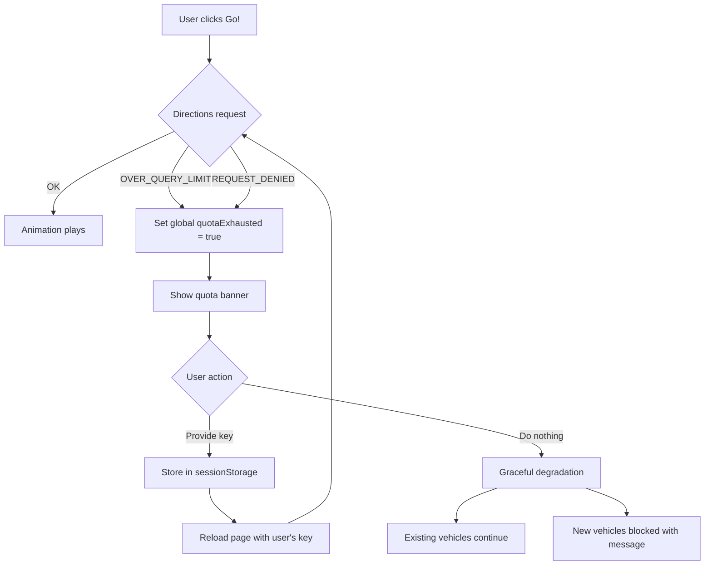

# Ticket 010: Handle Quota Exhaustion + "Bring Your Own Key"

**Priority:** Medium
**Severity:** P2
**Estimated Effort:** 1 day

---

## Description

When the free monthly quota is exhausted, the app should gracefully degrade instead of silently breaking. Users should be able to provide their own API key to continue using the demo.

---

## Scope

### 1. Quota exceeded detection

- Catch `OVER_QUERY_LIMIT` status from `DirectionsService` and `Geocoder`
- Catch `REQUEST_DENIED` (API key disabled/invalid)
- Track error state globally — once quota is hit, show banner immediately instead of retrying

### 2. Quota exhausted banner

- Non-intrusive banner at the top of the page
- Message: *"Free demo quota for this month is exhausted. The map will still work, but routing and geocoding are disabled."*
- Option: *"Use your own API key"*

### 3. "Bring Your Own Key" flow

- Inline input field + "Apply" button
- Key stored in `sessionStorage` (cleared on tab close, not visible across tabs from strangers)
- On apply: reload the page with the user's key injected into the Maps API script tag
- Button to clear the custom key and revert to default

### 4. Graceful degradation

- When quota is hit but no custom key is provided:
  - Cars that already have routes continue animating
  - New car creation fails with a friendly error
  - Plane creation fails (requires geocoding)
  - Existing UI controls still work, just no new routes

---

## Flow

---

## Expected Outcome

- User sees a clear message when quota is exhausted
- User can paste their own API key and restart the demo
- App works normally with the user's key
- User can revert to the default key with one click
- No broken UI or silent failures

---

## Concerns

1. User-provided keys are used from the client side — anyone can see them in the network tab. But since the key is in `sessionStorage`, it's not shared across sessions and clears on tab close.
2. If a user provides a key with no billing enabled, the Maps JS API still loads (dev mode watermark) but Directions/Geocoding fail. Should handle this gracefully too.

---

## Dependencies

- **Blocked by:** Ticket 001 (API migration — need the error handling infrastructure)
- **Blocked by:** Ticket 003 (API key externalization — need the key swap mechanism)

---

## Related Tickets

- Ticket 001: Migrate to Maps API v3
- Ticket 003: Externalize API key
